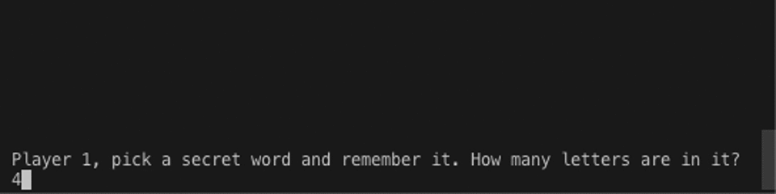
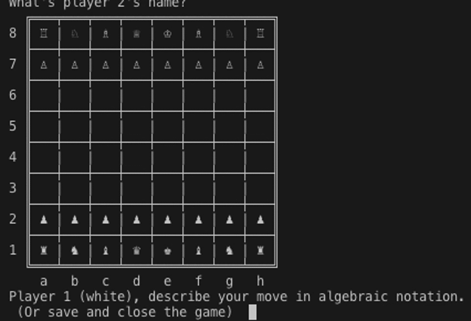

# Board Games 

Play a series of games against the AI or another player using the command line. You can save and reload any game.

## Installation
First clone the repo:
```
$ cd /path/to/repos
$ git clone https://github.com/HerrHemd/board_games.git board_games
$ cd board_games
```

Install the gems you'll need:
```
$ bundle install
```

Run with:
```
$ bundle execute ruby lib/main.rb
```

## The Games

### Mastermind

- Guess the secret code and get feedback. i.e. the number of correct colours in the right place, and the number of correct colours in the _wrong_ place
- Play with up to 8 colours and 8 holes
#### 1-Player mode
- Guess a secret code randomly chosen by the computer
- Or choose your own secret code to try to stump the AI's guessing algorithm
- AI minimizes worst case number of guesses needed (eg always guesses a 4-hole, 6-colour code in 5 guesses).
- Each turn the AI uses each valid code (including those it has ruled out) to partition the codes it hasn't ruled out into groups. Each group contains codes that would respond in the same way if they were correct and the partitioning code was guessed. The AI then compares the largest groups created by each partitioning code and chooses the partitioning code that creates the smallest maximum group. (In a case of a tie, the AI prefers codes that haven't been ruled out, then the smallest next-to-maximum group, etc.)
#### 2-Player mode
- Masks your input so you can enter your code in secret
- The computer will give your opponent feedback

### Hangman

#### 1-Player mode
- Guess a word randomly chosen from the computer's dictionary
- Or choose a word for the AI to guess, giving feedback on its guesses
- The AI will guess the letter that occurs in the most words it hasn't ruled out. If your word isn't in its dictionary, it guesses by letter frequency.
#### 2-Player mode
- Masks your input so you can enter your word in secret
- The computer will give your opponent feedback

### Tic-Tac-Toe

#### 1-Player mode
- Plays tic-tac-toe (noughts and crosses) optimally. It will not lose, and it punishes mistakes.
- AI conostructs a trie of game states under the starting position and each turn chooses the branch that maximizes the number of moves ahead it opponent needs to think, and secondarily the opportunities for opponent mistakes.
#### 2-Player mode
- PvP mode alse available

### Nim

- Players take it in turns to take as many objects they like - as long as they're from the same line (heap)
- The player who takes the last object loses
- Choose the number of heaps in each game, or let the computer choose them randomly
#### 1-Player mode
- AI plays nim optimally. Always wins as quickly as possible unless the nimsum is zero, in which case it plays to prolongs the game
#### 2-Player mode
- PvP mode also available

### Chess

- Specify moves using flexibly interpreted [agebraic notation](https://en.wikipedia.org/wiki/Algebraic_notation_(chess))
- All [FIDE rules of play](https://www.fide.com/FIDE/handbook/LawsOfChess.pdf) are implemented except draws by repition, or by 50 moves without capture or movement of a pawn
#### 2-player mode
- Only mode available

## Roadmap
- Major refactor of code to decouple views and models
- Implement RESTful web interface

## License

All source code in this app is under the MIT License. See [LICENSE.md](LICENSE.md) for details.